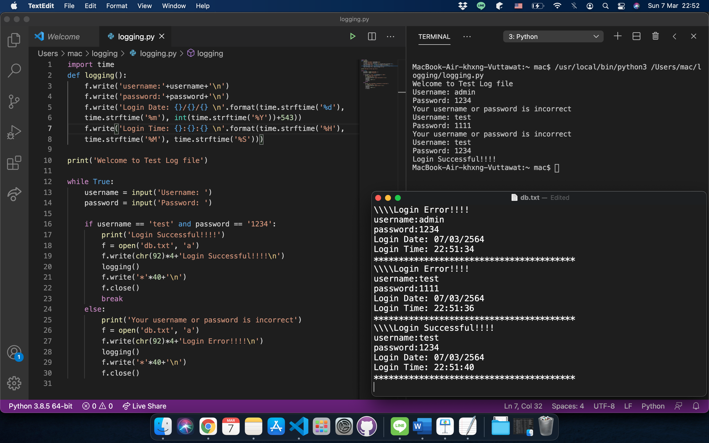
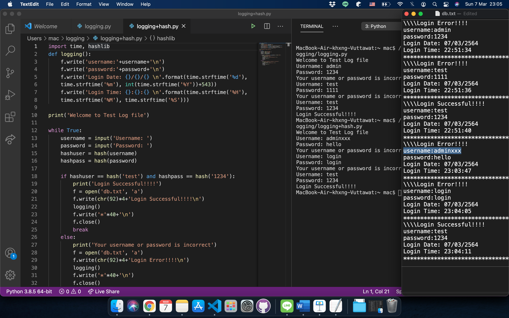
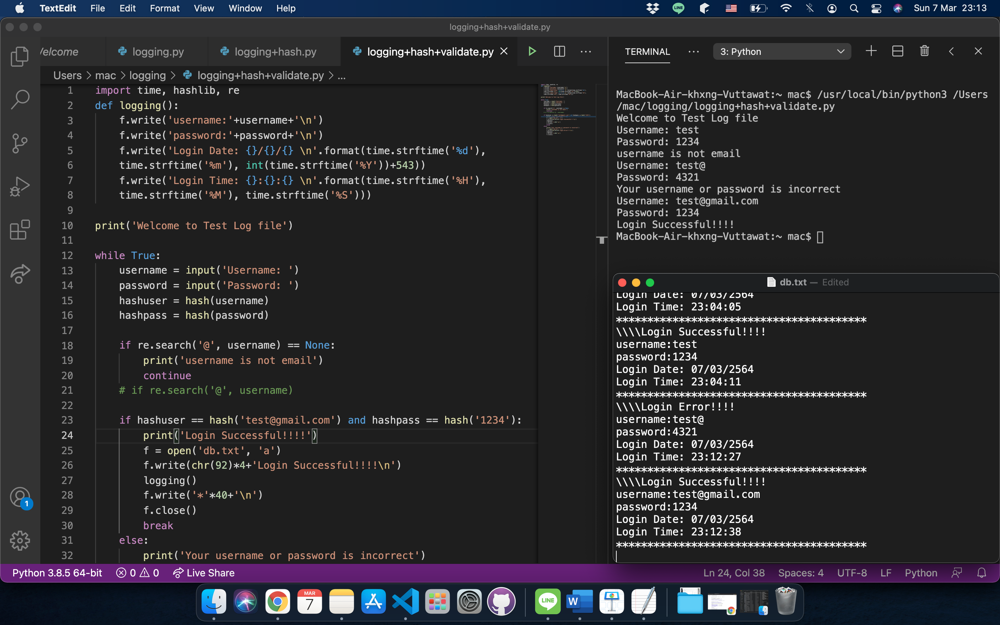

## **Logging with Hash and Data Validation**.  

  
  
  
This is example to write Python for record Log-in logging.  
  
## First, Let's try a simple one.  
Using Python's standard library, **import time** to write down the time that user do a log-in.  

  
  
  
## Second, Add Hashing.  
While today most secured database servers do not keep plain text of username and password to prevent the data leak, they keep the data in hashing format, using **import hashlib** and **hash()**, instead. Due to we just testing and we do not create data base yet, so we have to do a little tricky in the checking condition :P.   

  
  
However, we think the logging still should to record in plain text because we can see what users trying to log-in. We can use this log to predict or preventing 'Brute Force' things.   
  
## Finally, make more secure with Data Validation.  
Again with Python's standard library, **import re**, we can check a word in the string using **re.search(X, Y)**. Data validation use in prevent script injection and risk of data with imperfections.  

  
  
  
**Another secure function is done!** Secured coding is just a flipped hand when you know the hint!
    
## Credit to our team mate:  
Mr.Sakarin Kaewsathitwong and Mr.Sanchat Phaisit

  &nbsp; &nbsp; &nbsp;  
  

______________________________
<table border="0">
 <tr>
   <td> <h3><i>Although my profile picture is quiet, but the real me can make some noise.</i></h3>
      

      <b> Author: Vuttawat Uyanont </b>   
      <i>Sexiest former engineer & banker who interested in Tech, Sake, and Beer.</i>   
      <b>Studying:</b> Master Computer Science in Cybersecurity Management at Mahanakorn University.    </td>  
   <td></td>  
 </tr>
</table>
  
